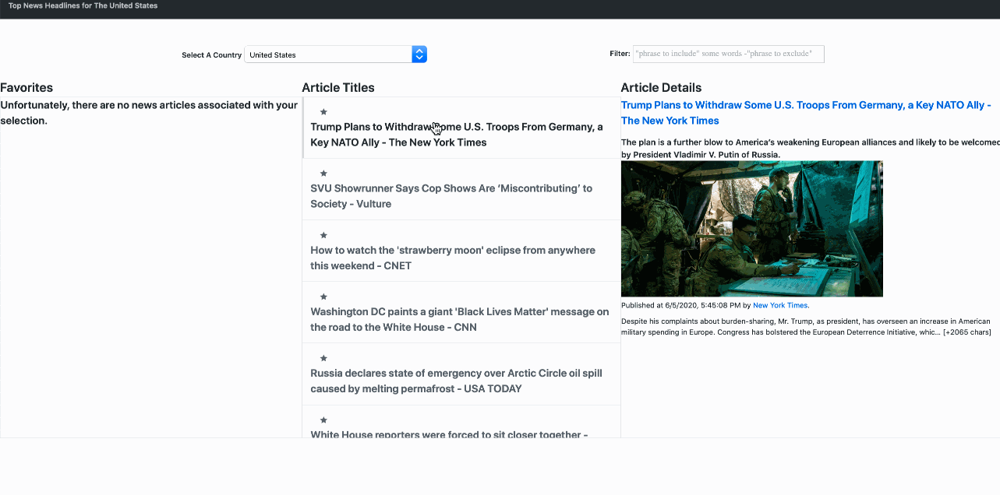

# Trending News SPA Dashboard

This is a Trending News Dashboard, built with vanilla ES6 (ES7+) javascript, and tested with Jest (for mocking API calls) and Cypress (for end-to-end user experience testing).



## How To Set Up, Run, and View Tests (CLI/BASH directions)

Note: These directions are for a Linux or MacOS machine. If you are running on
Windows, you can still follow these instructions, once you've set up [Linux Subsystem for Windows](https://www.howtogeek.com/249966/how-to-install-and-use-the-linux-bash-shell-on-windows-10/) (or just do the first two steps as you normally would, but on Windows).

-1. Install [NVM](https://github.com/nvm-sh/nvm#about):

```bash
curl -o- https://raw.githubusercontent.com/nvm-sh/nvm/v0.35.3/install.sh | bash
```

0. Use the latest version of Node.js (because it has some useful features – [supports top-level await](https://github.com/nodejs/node/blob/master/doc/changelogs/CHANGELOG_V14.md#support-for-top-level-await), [tracks function calls](https://github.com/nodejs/node/blob/master/doc/changelogs/CHANGELOG_V14.md#track-function-calls-with-assertcalltracker-experimental) (may be convenient for testing, at some point –  so why not?):

```bash
nvm install 14
nvm alias default node
```

1. Install Dependencies.

```bash
npm install
```

2. Transpile the ES6 down to ES5 for compatibility with testing libraries.

```bash
npm run build
```

3. Run the backend.

```bash
npm run start:dev
```

4. Run the Jest and Cypress tests.

```bash
npm test
```

5. Open up `http://localhost:3033` in your browser to use the Trending News SPA.

```bash
open http://localhost:3033
```

## Features

- Utilizes a public API via the app-server wrapper (to comply with the same-origin policy, bypassing CORS)
- List view (ie, "master" in "master detail")
- Detail view
- On-page / API level filtering for the list view
- Unit testing via Jest using a mocha/chai-like API, with mocked requests for the news API
- End-to-end testing via Cypress
- localStorage API to Favorite/Un-favorite articles
- CSS styling so that it looks like a professional webpage
