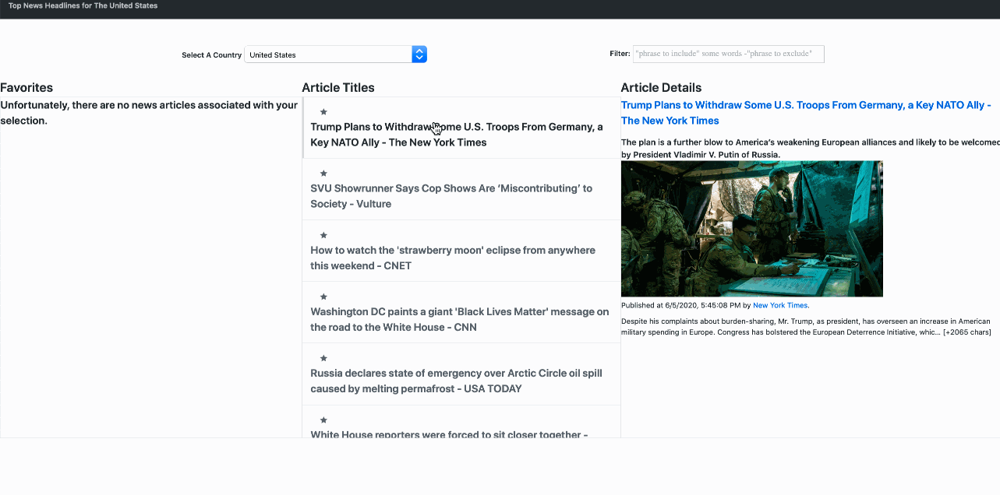

# Trending News SPA Dashboard

This is a Trending News Dashboard, built with vanilla ES6 (ES7+) javascript, and tested with Jest (for mocking API calls) and Cypress (for end-to-end user experience testing).


## How To Set Up, Run, and View Tests (CLI/BASH directions)

Note: These directions are for a Linux or MacOS machine. If you are running on
Windows, you can still follow these instructions, once you've set up [Linux Subsystem for Windows](https://www.howtogeek.com/249966/how-to-install-and-use-the-linux-bash-shell-on-windows-10/) (or just do the first two steps as you normally would, but on Windows).

-1. Install [NVM](https://github.com/nvm-sh/nvm#about):

```bash
curl -o- https://raw.githubusercontent.com/nvm-sh/nvm/v0.35.3/install.sh | bash
```

0. Use the latest version of Node.js (because it has some useful features – [supports top-level await](https://github.com/nodejs/node/blob/master/doc/changelogs/CHANGELOG_V14.md#support-for-top-level-await), [tracks function calls](https://github.com/nodejs/node/blob/master/doc/changelogs/CHANGELOG_V14.md#track-function-calls-with-assertcalltracker-experimental) (may be convenient for testing, at some point –  so why not?):

```bash
nvm install 14
nvm alias default node
```

1. Install Dependencies.

```bash
npm install
```

2. Transpile the ES6 down to ES5 for compatibility with testing libraries.

```bash
npm run build
```

3. Run the backend.

```bash
npm run start
```

4. Run the Jest and Cypress tests.

```bash
npm test
```

Note: If the tests fail, ensure `const testEnv = true;` is appropriately set in `public/javascripts/config.js`, then rebuild and restart the backend (steps 2 and 3, before continuing with this step).

5. Open up `http://0.0.0.0:3033` in your browser to use the Trending News SPA.

```bash
open http://0.0.0.0:3033
```

Note: If the you notice that the API calls are incorrect, ensure `const testEnv = false;` is appropriately set in `public/javascripts/config.js`, then rebuild and restart the backend (steps 2 and 3, before continuing with this step).

## Features

- Utilizes a public API via the app-server wrapper (to comply with the same-origin policy, bypassing CORS)
- List view (ie, "master" in "master detail")
- Detail view
- On-page / API level filtering for the list view
- Unit testing via Jest using a mocha/chai-like API, with mocked requests for the news API
- End-to-end testing via Cypress
- localStorage API to Favorite/Un-favorite articles
- CSS styling so that it looks like a professional webpage
- Works on Chrome, Safari, Android, iOS (thanks to Babel for allowing modern/experimental JS with plugins)
- Error-free linting and tests required pre-commit via Git Hooks

## Deploy Instructions

### Step 1: Update public/javascripts/config.js

You will need to change `const testEnv = true;` to `const testEnv = false;` in `public/javascripts/config.js`, and update your public URL from `const publicApiURL = 'https://riyadshauk.com/news';` to whatever your public URL is that is accessible from the statically served files in any browser.

### Step 2: Serve the website from your webserver of choice

#### Heroku, other PaaS

It should work as usual, more or less.

#### NGINX

The following example location block will work, assuming your Nginx user has read access to your static files. If your `publicApiURL` is, for example, `https://riyadshauk.com/news`, then the webpage should work, ceteris paribus (assuming the rest of your nginx file and system is configured correctly – for https, etc).

```nginx
location /news {
  alias /var/www/news/public;
  location /news/api {
    proxy_pass http://127.0.0.1:3033/api;
  }
  try_files $uri $uri/ =404;
}
```

## Changelog

### v0.0.0-beta.1

- Improve overall look and feel (UX), mostly with CSS, some JavaScript.
- Add SVG button to toggle Favorites visibility (all HTML/CSS).
- Add corresponding e2e integration tests using Cypress, self-documenting updates.

### v0.0.0-beta.0

- Initial MVP ready.

